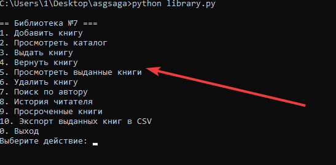
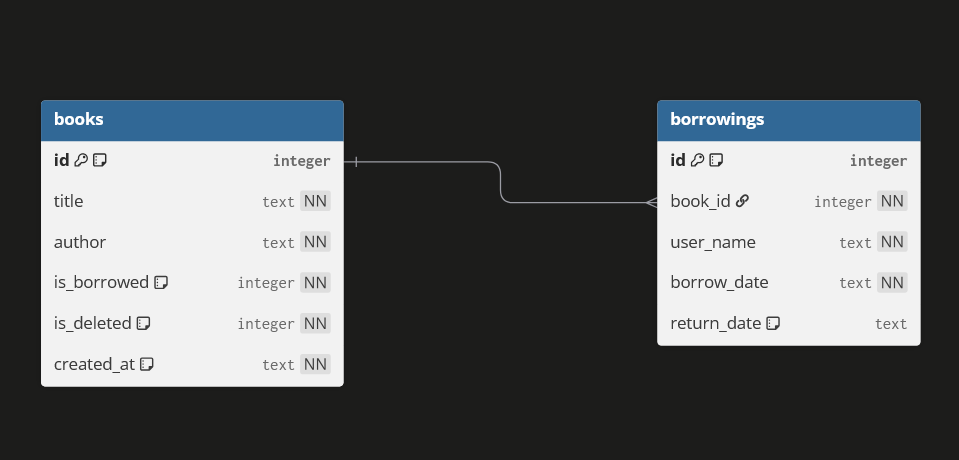

# Библиотека

Консольное приложение для учёта книг, выдач и возвратов в библиотеке.

## Описание задачи

https://disk.yandex.ru/i/r7CKIRYeyQgaWw

## Технологии

- Python 3.10+
- SQLite (модуль `sqlite3` из стандартной библиотеки)

## Установка и запуск

1. Склонируйте репозиторий:

```bash
git clone <ссылка>
cd library
```

2. Запустите приложение:

```bash
python library.py
```

Без аргументов откроется интерактивное меню.

Также можно использовать команды напрямую:

```bash
python library.py add-book --title "Мастер и Маргарита" --author "Михаил Булгаков"
python library.py list
python library.py borrow 1 --user "Егор"
python library.py return 1
python library.py borrowed
python library.py delete-book 1
python library.py search-author "Булгаков"
python library.py history "Егор"
python library.py overdue
python library.py export-csv borrowed_books.csv
```

Если не передать `--title`, `--author` или `--user`, приложение запросит значение пошагово.

База SQLite создаётся автоматически в `data/library.sqlite3`.

## Примеры использования



## Структура проекта

```text
|- library.py          # точка входа, CLI и интерактивное меню
|- database.py         # подключение к SQLite и SQL-запросы
|- models.py           # модели данных (Book, Borrowing)
|- utils.py            # вспомогательные функции (ввод, таблицы, логирование)
|- config.py           # пути и настройки
|
- sql/
|   |- schema.sql      # SQL-скрипт создания таблиц
|   |- seed.sql        # тестовые данные
|
|- docs/
|   |- er-diagram.png  # ER-диаграмма базы данных
|
|- requirements.txt    # зависимости
|- README.md           # инструкция по установке и запуску
|- .gitignore          # исключённые файлы
```

## Схема базы данных



## Известные проблемы

- Неизвестно

## Автор

Владимир, 2, 11ФО
